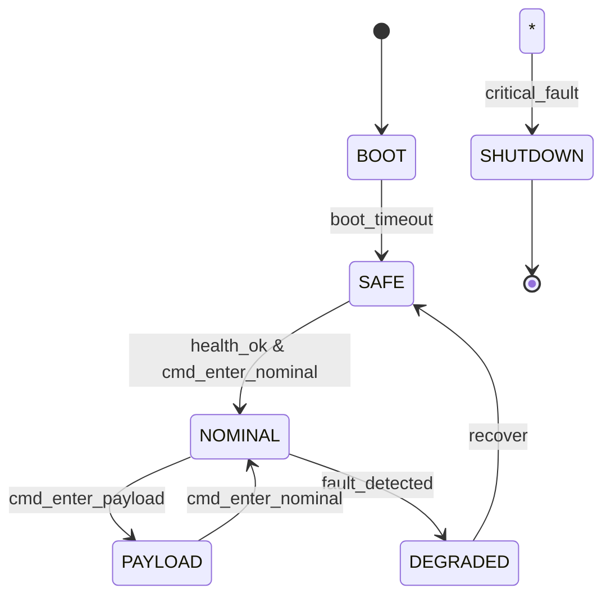

# Flight Mode Manager

This project implements a simulated Flight Mode Manager (FM) for a small satellite/CubeSat. It demonstrates:

- A deterministic state machine:  
  `BOOT -> SAFE -> NOMINAL -> PAYLOAD -> DEGRADED -> SHUTDOWN`
- Watchdog monitoring and reset behavior
- Command handler for ground commands
- Fault detection logic (IMU/GPS/CPU/power)
- Telemetry packet formatter (binary-like)


## State Machine




# Clean previous builds

```
make clean

```
# Build the Flight Mode Manager

```
make all

```
# Run

```
./bin/flight_mode_manager

```

```
[MAIN] Interactive console. Type commands (NOMINAL/SAFE/DEGRADED/PAYLOAD/BOOT/SHUTDOWN/KICK). Type EXIT to stop.

```